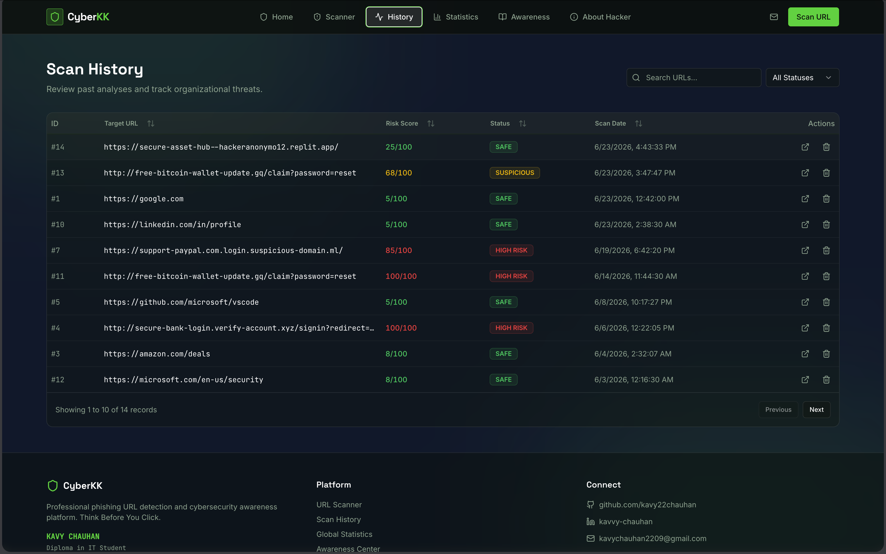
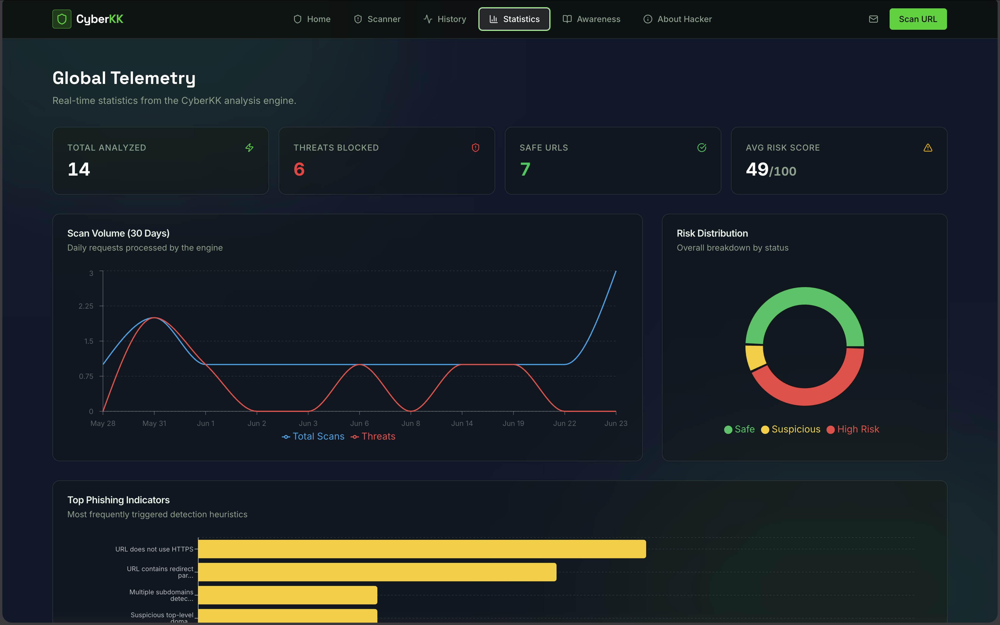
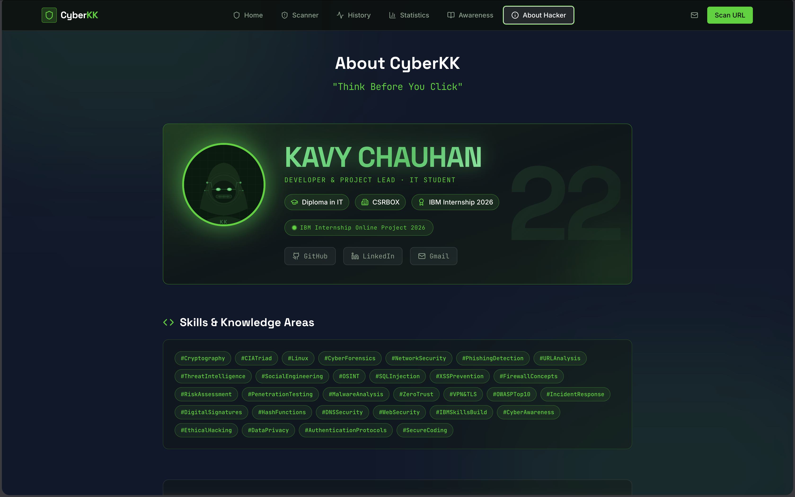

# Cyberkk
CyberKK is a phishing URL detection platform that analyzes website links for suspicious indicators and calculates a risk score to help users avoid online scams.

 

step by step use of website  URL:-https://secure-asset-hub--hackeranonymo12.replit.app/
1. open any browser.
2. paste the link.
3. go for scann url now.
4. paste risky or malicious link here.
5. get your result.
 
 

This is a fist look of the website.
also, Here is the scanner to check malicious URL's.
 

 
 
In this page is history of Different searches.
 

 
 
This page represents global Telemetry and Statistics
 

 
 
This is my profile you can contact or connect with me for cybersecurity,networking,linux knowledge.  🜲
 

